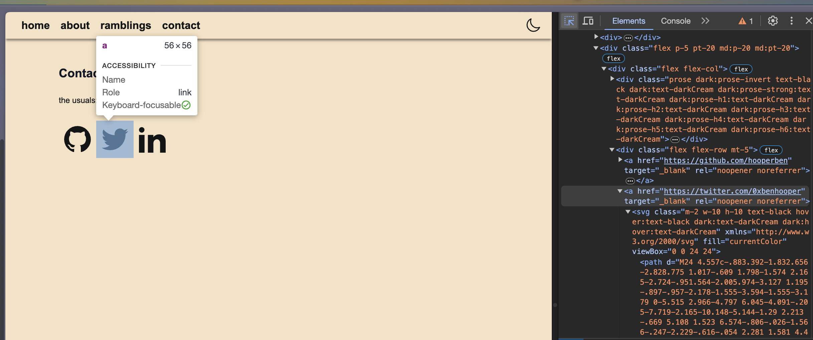
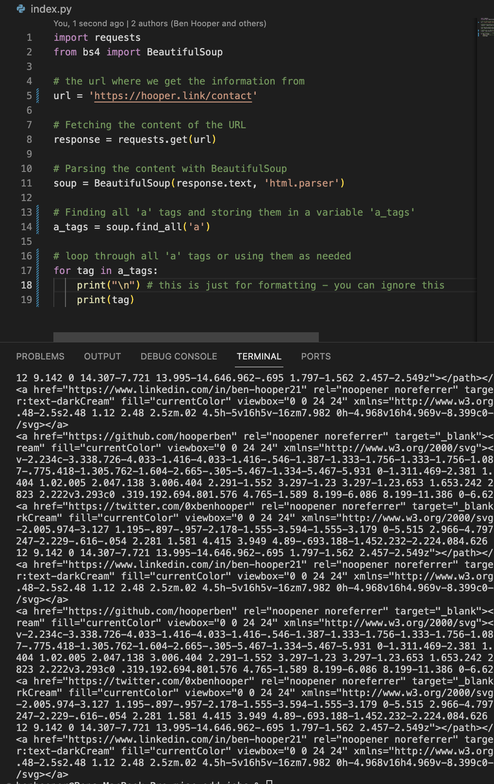
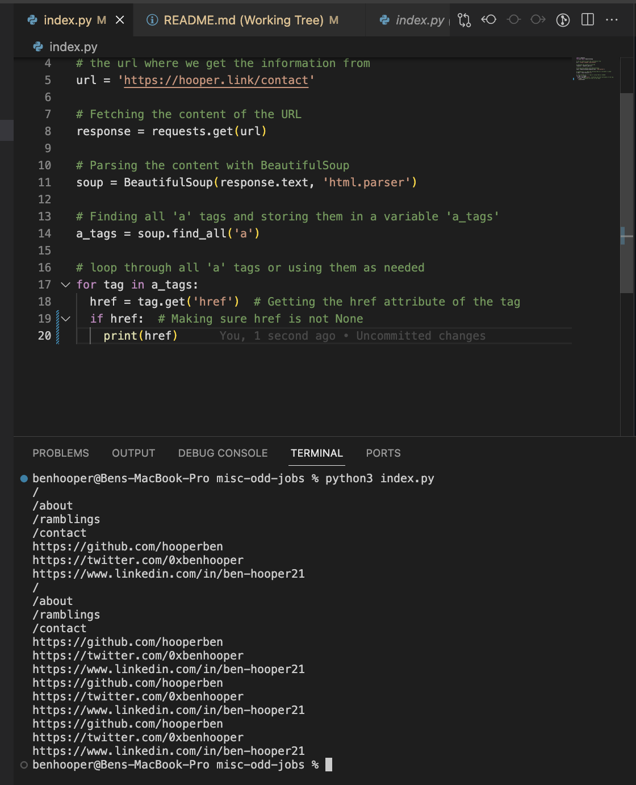

# How to Web Scrape

Say I want to go to my cool website, hooper.link - specifically the contact page (hooper.link/contact) and get my twitter URL.

The first thing I need to do to write this program is figure out where the information I want is located on the page. I can do this by right clicking on the page and clicking "Inspect Element" (or something similar depending on your browser). This will open up the developer tools and show you the HTML code for the page.

As you can see here - the information I need is located in an <a> tag, so lets write our program to go to the page and find our a tags.

That program would look like this:

As you can see, it does find all our our a tags, but it also finds a lot of other stuff we don't need. So lets narrow it down a bit.

